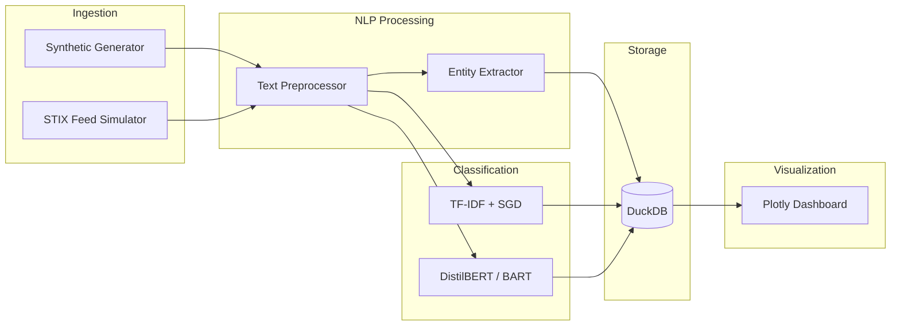

# Threat Intelligence Pipeline

[](https://www.python.org/downloads/)
[](LICENSE)
[](https://github.com/astral-sh/ruff)

An end-to-end ML pipeline for generating, processing, classifying, and visualizing threat intelligence data. Built to demonstrate applied ML/NLP engineering for national security domains.

## Overview

This pipeline processes threat intelligence reports through a multi-stage NLP and ML workflow:

1. **Synthetic Data Generation** — Realistic threat reports with embedded IOCs, STIX 2.1 bundles
2. **NLP Processing** — Text normalization, IOC extraction, entity recognition
3. **Multi-label Classification** — TF-IDF/SGD baseline + transformer-based classifiers
4. **Persistent Storage** — DuckDB analytical database for processed results
5. **Interactive Visualization** — Plotly dashboards with classification distributions, timelines, entity analysis

## Architecture



## Features

- **10 threat categories**: APT, malware, phishing, vulnerability, ransomware, supply chain, insider threat, DDoS, data exfiltration, zero-day
- **IOC extraction**: IPv4, domains, SHA-256/MD5 hashes, CVEs, MITRE ATT&CK technique IDs
- **Entity recognition**: Threat actors (APT28, Lazarus Group, etc.), malware families (Emotet, Cobalt Strike, etc.), MITRE techniques
- **STIX 2.1 generation**: Compliant threat objects with relationships
- **Multi-label classification**: Reports can belong to multiple categories simultaneously
- **Dual classifier architecture**: Fast TF-IDF baseline + transformer zero-shot/fine-tuned models
- **Pipeline tracking**: Run metadata, metrics, and results persisted for reproducibility

## Quick Start

### Installation

```bash
git clone https://github.com/osth0006/threat-intel-pipeline.git
cd threat-intel-pipeline
python -m venv venv
source venv/bin/activate
pip install -r requirements.txt
```

### Run the Pipeline

```bash
# Full pipeline: generate → process → classify → store → visualize
python cli.py run --n-reports 500

# Generate synthetic data only
python cli.py generate --n-reports 100 --output data/reports.json

# View database statistics
python cli.py stats

# Regenerate charts from stored data
python cli.py visualize

# Classify a single text
python cli.py classify "APT28 deployed Cobalt Strike via spear-phishing targeting government networks"
```

### Example Output

```
Threat Intelligence Pipeline
Processing 500 reports with tfidf_sgd classifier

⠋ Generated 500 reports
⠋ Preprocessed 500 reports, found 1847 IOCs
⠋ Extracted 3291 entities
⠋ Classified 500 reports (F1=0.842)
⠋ Results stored in DuckDB
⠋ Generated 10 charts

────────────── Pipeline Results Summary ──────────────
┃ Metric             ┃    Value ┃
┡━━━━━━━━━━━━━━━━━━━━╇━━━━━━━━━┩
│ Reports Generated   │     500 │
│ Reports Classified  │     500 │
│ Entities Extracted  │    3291 │
│ IOCs Found          │    1847 │
│ F1 (micro)          │  0.8420 │
│ F1 (macro)          │  0.7856 │
│ F1 (weighted)       │  0.8312 │
└─────────────────────┴─────────┘

Pipeline complete!
```

## Project Structure

```
threat-intel-pipeline/
├── cli.py                          # Click CLI interface
├── pyproject.toml                  # Project configuration
├── requirements.txt                # Dependencies
├── src/
│   ├── __init__.py
│   ├── pipeline.py                 # Pipeline orchestrator
│   ├── ingestion/
│   │   ├── generator.py            # Synthetic threat report generator
│   │   └── stix_feeds.py           # STIX 2.1 feed simulator
│   ├── processing/
│   │   ├── preprocessor.py         # Text cleaning & IOC extraction
│   │   └── entity_extractor.py     # Threat entity recognition
│   ├── classification/
│   │   ├── classifier.py           # TF-IDF + SGD multi-label classifier
│   │   └── transformer_classifier.py  # DistilBERT/BART classifier
│   ├── storage/
│   │   └── database.py             # DuckDB storage layer
│   └── visualization/
│       └── charts.py               # Plotly chart generation
├── tests/
│   ├── test_generator.py
│   ├── test_preprocessor.py
│   ├── test_entity_extractor.py
│   ├── test_classifier.py
│   ├── test_database.py
│   └── test_pipeline.py
├── data/
│   └── samples/
│       └── sample_reports.json     # Example synthetic data
├── scripts/
│   └── generate_samples.py         # Sample data generation script
└── docs/
    └── architecture.md             # Detailed architecture documentation
```

## Classification Approach

### Baseline: TF-IDF + SGD
- **Vectorization**: TF-IDF with 1-3 gram features, sublinear TF scaling
- **Classifier**: SGD with modified Huber loss (calibrated probability estimates)
- **Strategy**: OneVsRest for multi-label support
- **Performance**: ~0.84 F1-micro on synthetic data

### Advanced: Transformer Models
- **Zero-shot**: BART-large-MNLI for classification without training data
- **Fine-tuned**: DistilBERT with multi-label classification head
- **Auto device**: CUDA / MPS / CPU fallback

## Threat Categories

| Category | Description |
|----------|-------------|
| `apt` | Advanced persistent threat / state-sponsored espionage |
| `malware` | Malicious software families and variants |
| `phishing` | Social engineering and credential harvesting |
| `vulnerability` | Software vulnerabilities and CVE exploitation |
| `ransomware` | Encryption-based extortion attacks |
| `supply_chain` | Software supply chain compromises |
| `insider_threat` | Insider access abuse and data theft |
| `ddos` | Distributed denial of service attacks |
| `data_exfiltration` | Unauthorized data collection and transfer |
| `zero_day` | Zero-day exploit campaigns |

## Entity Extraction

The pipeline extracts domain-specific entities:

- **Threat Actors**: APT28, Lazarus Group, Sandworm, Volt Typhoon, etc. (25+ groups)
- **Malware Families**: Emotet, Cobalt Strike, SolarWinds SUNBURST, etc. (23+ families)
- **MITRE ATT&CK**: T1566 (Phishing), T1059 (Command Interpreter), etc. (26+ techniques)
- **IOCs**: IPv4 addresses, domains, SHA-256/SHA-1/MD5 hashes, CVEs, email addresses

## Testing

```bash
# Run all tests
pytest tests/ -v

# Run with coverage
pytest tests/ --cov=src --cov-report=term-missing

# Run specific test module
pytest tests/test_classifier.py -v
```

## Tech Stack

| Component | Technology |
|-----------|-----------|
| Language | Python 3.10+ |
| ML (baseline) | scikit-learn (TF-IDF, SGD, OneVsRest) |
| ML (advanced) | HuggingFace Transformers (DistilBERT, BART) |
| NLP | Regex-based NER, STIX 2.1 (stix2) |
| Storage | DuckDB |
| Visualization | Plotly |
| CLI | Click + Rich |
| Data | pandas |
| Testing | pytest |

## License

MIT

---

Built by [osth0006](https://github.com/osth0006)
