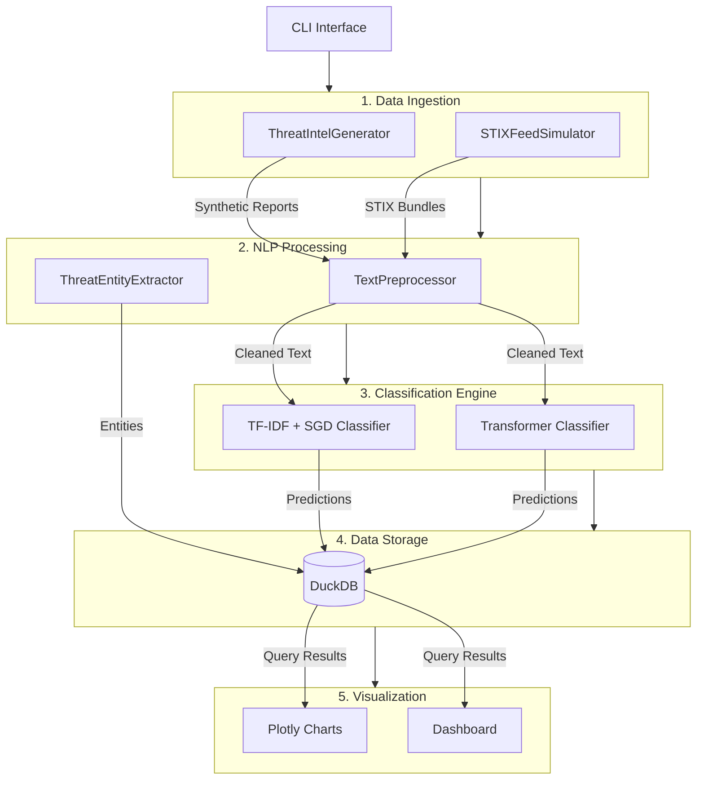

# Architecture

## System Overview

The Threat Intelligence Pipeline is a modular ML system for ingesting, processing, classifying, and visualizing threat intelligence data. The architecture follows a staged pipeline pattern with clear separation of concerns.

## Architecture Diagram

## Module Details

### 1. Data Ingestion (`src/ingestion/`)

**ThreatIntelGenerator** produces synthetic threat intelligence reports with:
- Realistic narrative text using domain-specific templates
- Embedded IOCs (IP addresses, domains, file hashes, CVEs)
- Threat actor and malware family references
- MITRE ATT&CK technique identifiers
- Multi-label category assignments across 10 threat types

**STIXFeedSimulator** generates STIX 2.1 compliant bundles containing:
- Threat Actor objects with attribution metadata
- Malware descriptions with family classification
- Indicator objects with STIX patterns
- Attack Pattern objects mapped to MITRE ATT&CK
- Relationship objects linking entities

### 2. NLP Processing (`src/processing/`)

**TextPreprocessor** handles:
- Text normalization with IOC preservation
- Whitespace and encoding cleanup
- IOC extraction using compiled regex patterns (IPv4, domains, hashes, CVEs, MITRE IDs)
- Token counting and feature computation

**ThreatEntityExtractor** performs:
- Named entity recognition for threat actors (dictionary + regex)
- Malware family identification
- MITRE ATT&CK technique extraction with ID resolution
- Technical IOC extraction with position tracking

### 3. Classification Engine (`src/classification/`)

**ThreatClassifier** (baseline):
- TF-IDF vectorization with n-gram features (1-3)
- SGD classifier with modified Huber loss (calibrated probabilities)
- OneVsRest wrapper for multi-label classification
- Model serialization via joblib

**TransformerClassifier** (advanced):
- Zero-shot classification using NLI models (BART-large-MNLI)
- Fine-tuned DistilBERT for multi-label classification
- Automatic device selection (CUDA/MPS/CPU)
- Batched inference with configurable thresholds

### 4. Data Storage (`src/storage/`)

**ThreatDatabase** provides:
- DuckDB-backed persistent storage
- Schema: threat_reports, classifications, extracted_entities, pipeline_runs
- Analytical query methods for aggregations and summaries
- Pipeline run tracking with metrics

### 5. Visualization (`src/visualization/`)

**ThreatVisualizer** generates:
- Classification distribution bar charts
- Severity breakdown donut charts
- Threat activity timeline area charts
- Entity frequency horizontal bar charts
- Combined multi-panel dashboard

## Data Flow

1. **Generate** → Synthetic reports created with realistic threat vocabulary
2. **Preprocess** → Text cleaned, IOCs extracted, tokens counted
3. **Extract** → Threat actors, malware, techniques, IOCs identified
4. **Classify** → Multi-label predictions with confidence scores
5. **Store** → All results persisted to DuckDB
6. **Visualize** → Interactive Plotly charts generated

## Design Decisions

- **DuckDB over SQLite**: Columnar storage optimized for analytical queries on threat data
- **TF-IDF baseline + transformer**: Demonstrates both classical ML and deep learning approaches
- **STIX 2.1 compliance**: Industry-standard format for threat intelligence exchange
- **Multi-label classification**: Real threat reports often span multiple categories
- **Synthetic data**: Enables full demonstration without classified/sensitive data
